# Project Description
The In today's dynamic automotive industry, understanding consumer preferences and optimizing pricing strategies are critical for manufacturers seeking to enhance profitability while meeting market demand. The project aims to delve into a comprehensive analysis of car features and their influence on pricing and profitability. By leveraging a dataset encompassing diverse car models and specifications, we aim to identify key factors driving consumer behaviour and profitability trends within the automotive market.

The dataset titled "Car Features and MSRP" provides a rich array of information, including details on car make, model, year, engine specifications, transmission type, fuel efficiency, market category, and manufacturer's suggested retail price (MSRP). Through thorough exploration and analysis of this dataset, we seek to uncover insights regarding the relationship between car features, pricing dynamics, and market demand. By employing data analysis techniques such as regression analysis and market segmentation, we aim to formulate actionable recommendations for manufacturers to optimize pricing strategies and product development efforts.

This project holds the potential to offer valuable insights into consumer preferences, market trends, and pricing strategies within the automotive industry. By leveraging data-driven insights, manufacturers can make informed decisions to enhance competitiveness, maximize profitability, and meet evolving consumer demands effectively.

# Approach
The initial step in our analysis involved downloading the dataset and conducting a thorough examination for missing values. We discovered null values in several features, including Engine Fuel Type, Engine HP, Engine Cylinders, and Number of Doors. Remarkably, despite constituting less than 1% of the dataset, these missing values were crucial for our analysis. Leveraging information from reputable automotive websites such as Edmunds, Concept Carz, Auto123, and Auto Evolution, we successfully retrieved and imputed the missing values, ensuring the integrity of our dataset (refer to the tables for imputation details).

Following data imputation, we proceeded to identify and address potential outliers within the dataset. While several outliers were observed across various features (refer to the box plots), our attention was drawn to a notable outlier in the Audi A6 2017 model. Upon investigation, we found that the recorded highway MPG value was 354, significantly deviating from the expected value of 34. Recognizing this as a probable typographical error, we corrected the outlier value to maintain data accuracy and consistency.

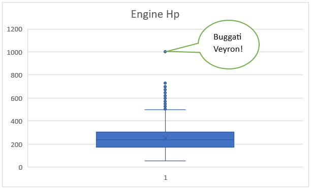

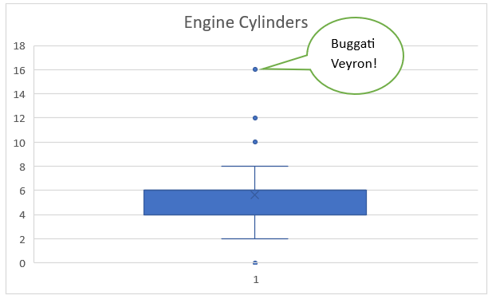

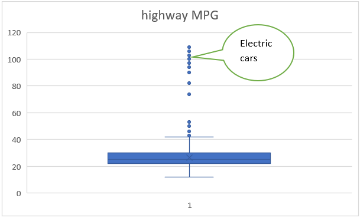

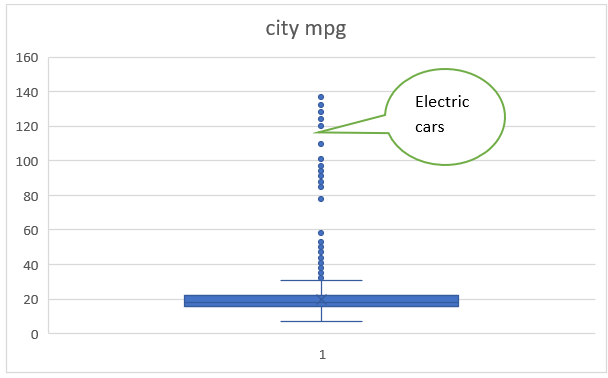

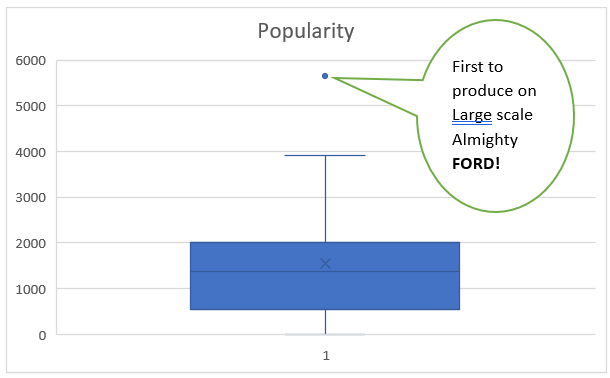

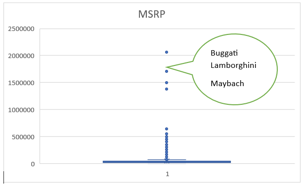

Subsequently, we evaluated the dataset for class imbalance and found no significant disparities, allowing us to proceed with further analysis confidently. With data integrity ensured, our subsequent analysis focused on deriving descriptive statistics and exploring key insights to inform our understanding of the impact of car features on pricing and profitability.

# Tech Stack Used
Microsoft Excel & Word 2021 version is used for this project due to its simplicity of use and extraordinary analysis and visualization capability.

# Analysis Tasks 
## Task 1.A: Create a pivot table that shows the number of car models in each market category and their corresponding popularity scores.
## Task 1.B: Create a combo chart that visualizes the relationship between market category and popularity.

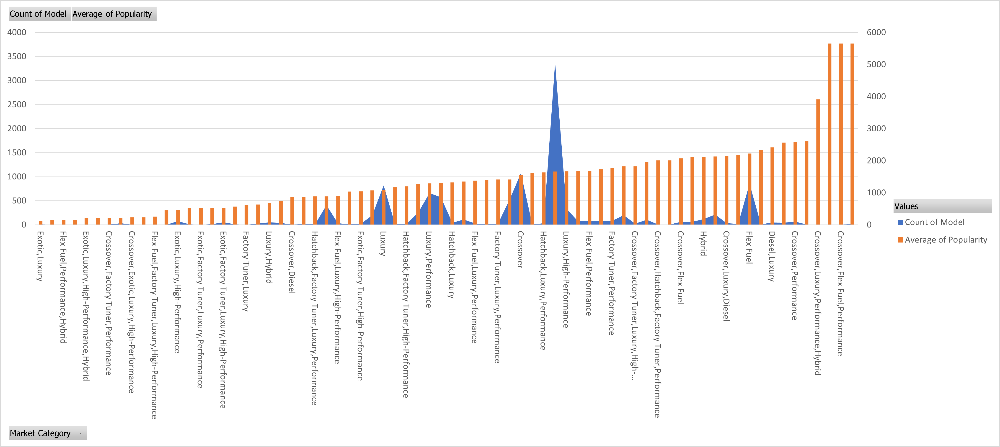

## Task 2:  Create a scatter chart that plots engine power on the x-axis and price on the y-axis. Add a trendline to the chart to visualize the relationship between these variables.

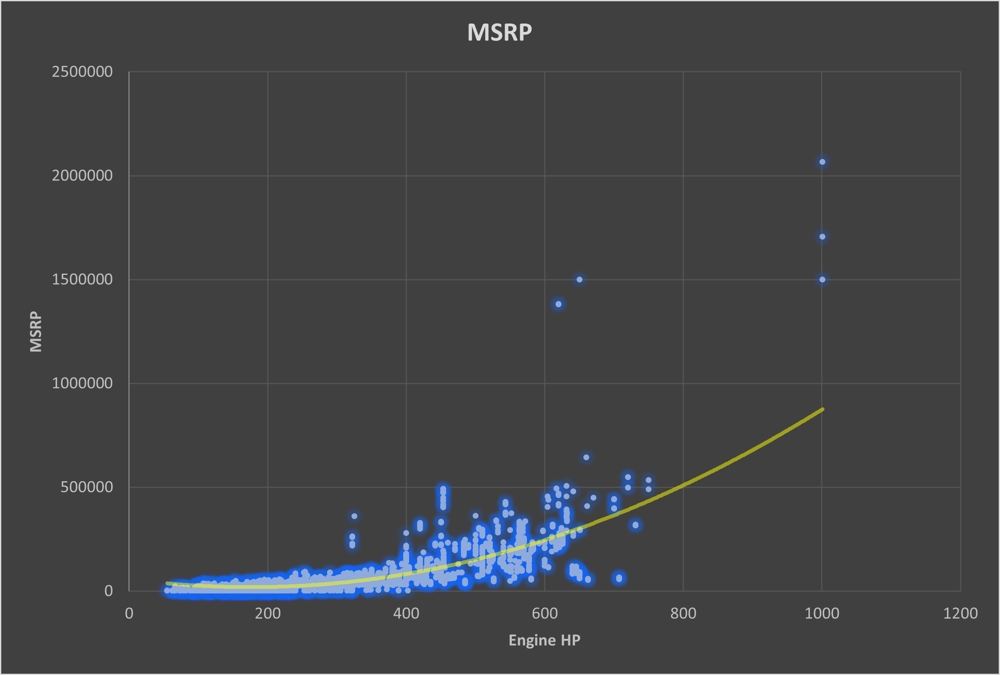

## Task 3: Use regression analysis to identify the variables that have the strongest relationship with a car's price. Then create a bar chart that shows the coefficient values for each variable to visualize their relative importance.

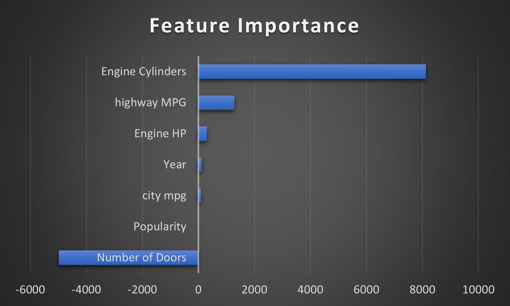

## Task 4.A: Create a pivot table that shows the average price of cars for each manufacturer. 
## Task 4.B: Create a bar chart or a horizontal stacked bar chart that visualizes the relationship between manufacturer and average price

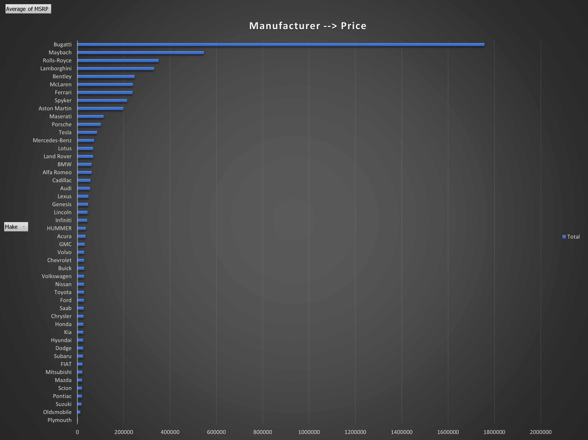

## Task 5.A: Create a scatter plot with the number of cylinders on the x-axis and highway MPG on the y-axis. Then create a trendline on the scatter plot to visually estimate the slope of the relationship and assess its significance.
## Task 5.B: Calculate the correlation coefficient between the number of cylinders and highway MPG to quantify the strength and direction of the relationship.

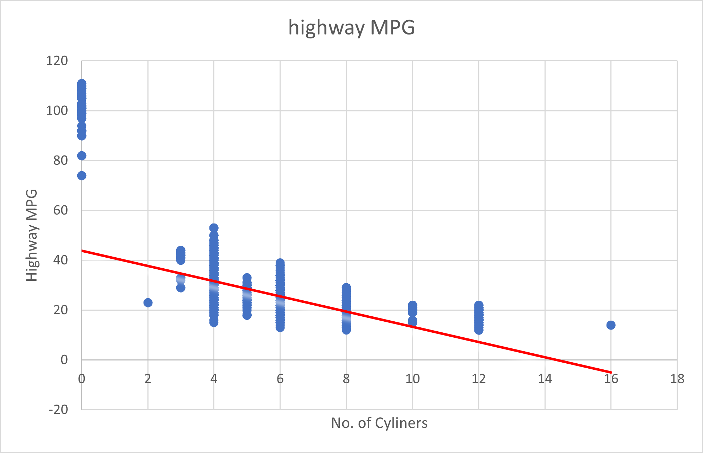

# Dashboard Tasks 

## Task 1: How does the distribution of car prices vary by brand and body style?

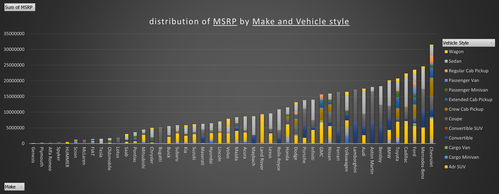

## Task 2: Which car brands have the highest and lowest average MSRPs, and how does this vary by body style?

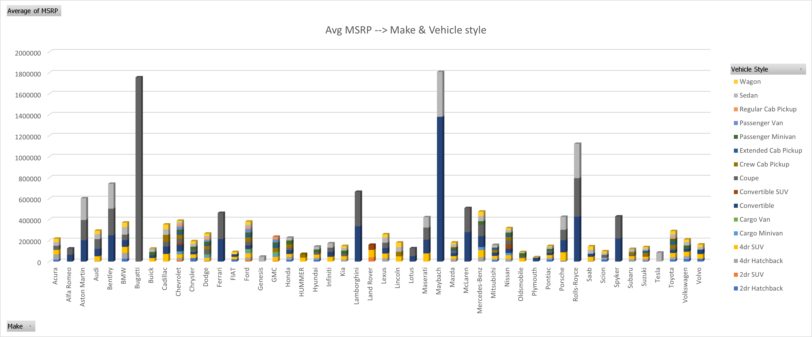

## Task 3: How do the different feature such as transmission type affect the MSRP, and how does this vary by body style?
- scatter plot

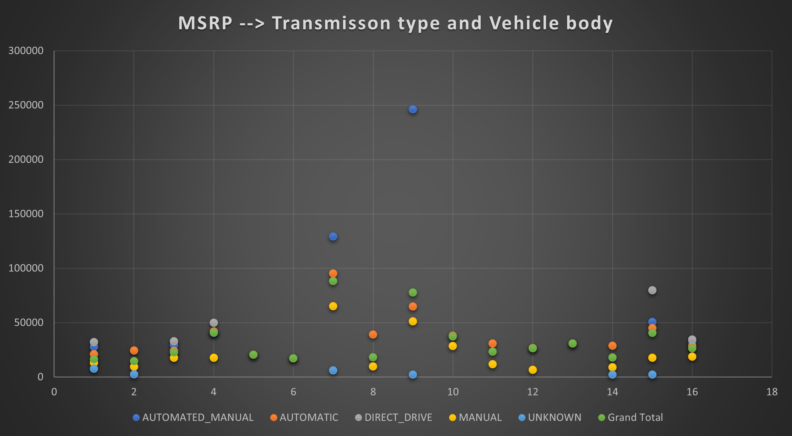

- Tree Map

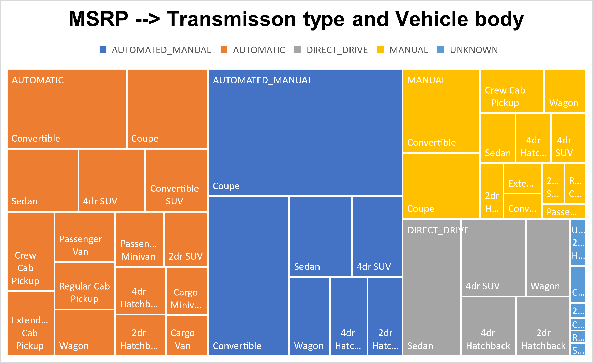

## Task 4: How does the fuel efficiency of cars vary across different body styles and model years?

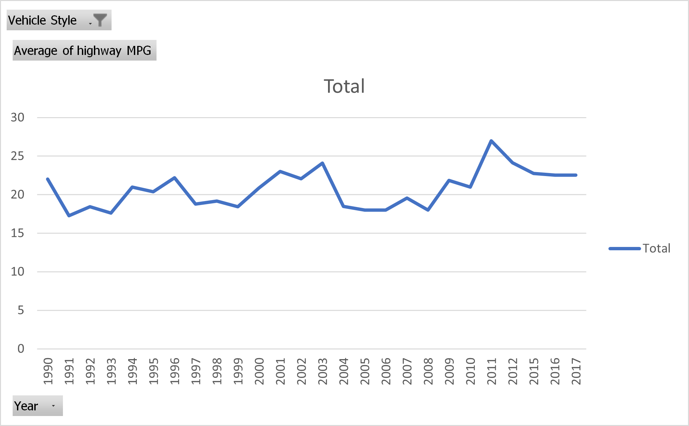

## Task 5: How does the car's horsepower, MPG, and price vary across different Brands?

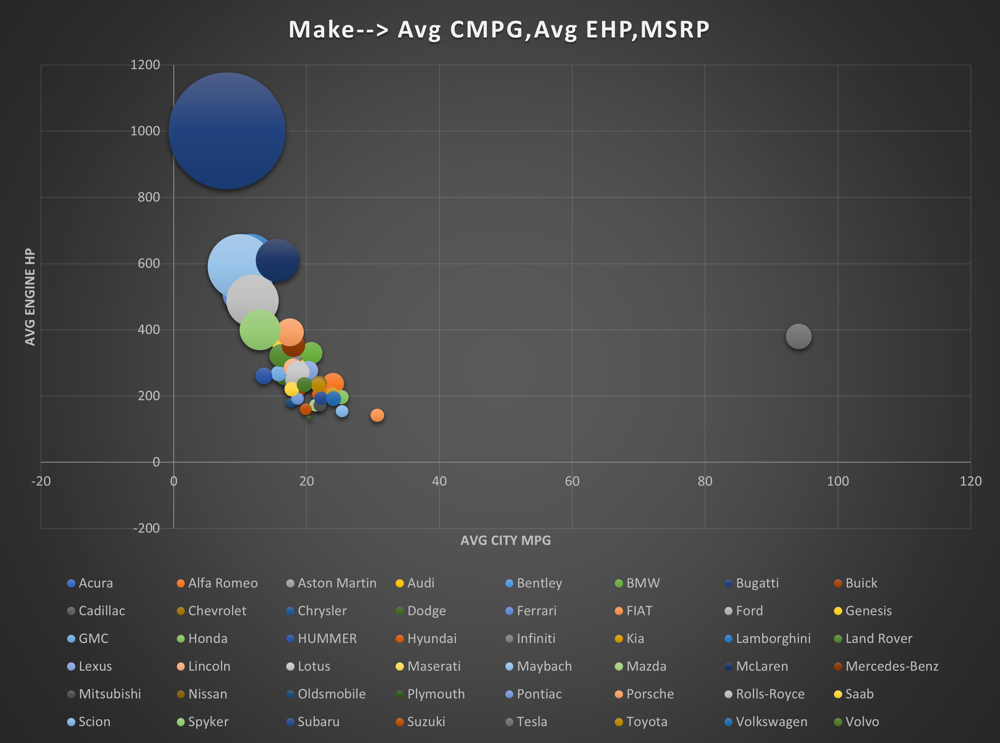

# Insights

- Task 1 - How does the popularity of a car model vary across different market categories? Analysis reveals that market categories such as "Exotic" and "Luxury" exhibit the lowest levels of popularity among all categories. Conversely, car models categorized as "Hatchback," "Flex Fuel," "Crossover," "Performance," and "Diesel" enjoy the highest levels of popularity, suggesting a strong consumer preference for these segments.
- Task 2 - What is the relationship between a car's engine power and its price? A clear positive correlation is observed between a car's engine power and its price. Notably, the Bugatti Veyron, boasting an impressive engine power of 1001, commands the highest price within the dataset, reaching a staggering $2,065,902.
- Task 3 - Which car features are most important in determining a car's price? Regression analysis highlights the significance of certain car features in determining price. Engine Cylinders emerge as the most influential factor, positively impacting price. Conversely, the number of doors demonstrates a negative impact, indicating that cars with fewer doors tend to command higher prices, particularly in the luxury segment.
- Task 4 - How does the average price of a car vary across different manufacturers? Manufacturer analysis reveals distinct pricing dynamics across various brands. Buggati and Maybach claim the top spots in terms of average price, catering to the premium segment. In contrast, Plymouth emerges as a more economical option, offering lower-priced models. Understanding these variations enables targeted marketing strategies to cater to specific consumer segments.
- Task 5 - What is the relationship between fuel efficiency and the number of cylinders in a car's engine? A negative relationship between fuel efficiency and the number of cylinders is observed for both highway and city MPG. Notably, electric cars, with zero cylinders, demonstrate superior fuel efficiency, while high-performance models like the Bugatti, equipped with 16 cylinders, exhibit lower MPG figures, highlighting the trade-off between engine power and fuel efficiency.

## Additional Insights:

- Relationship of driven wheels with fuel efficiency and popularity: Analysis reveals a clear association between driven wheel types, fuel efficiency, and popularity. Front-wheel-drive configurations emerge as the most fuel-efficient and popular choice, while four-wheel-drive configurations exhibit lower fuel efficiency and popularity.
- Relationship between fuel type and fuel efficiency: Electric cars emerge as the most fuel-efficient, followed by natural gas, while "flex-fuel" variants demonstrate the least fuel efficiency. These insights underscore the importance of fuel type selection in optimizing fuel efficiency and consumer appeal.

## Contact

If you have any feedback/are interested in collaborating, please reach out to me at  &nbsp; <a href="mailto:kvsvyas@gmail.com"> 

## License

[MIT](https://choosealicense.com/licenses/mit/)
